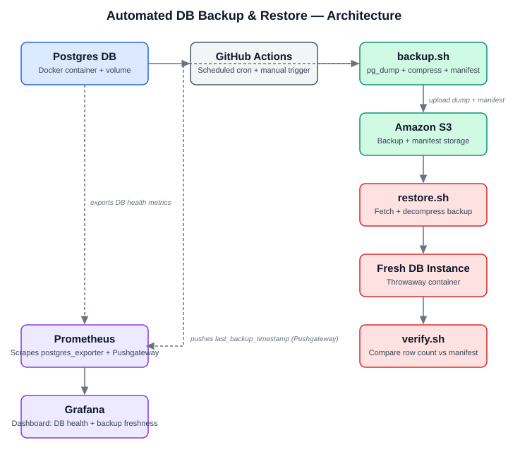
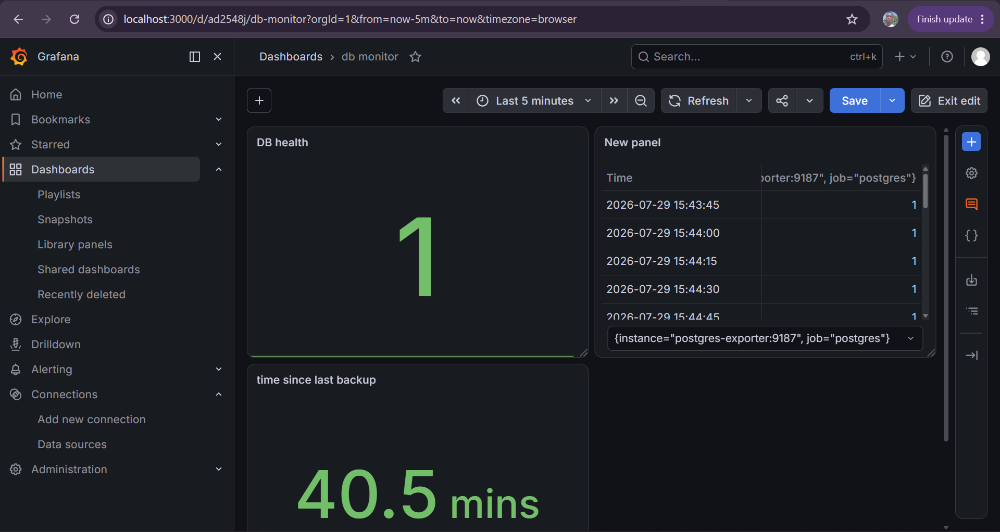

# Automated Database Backup & Restore (DO-04)

Automated, verifiable backup and restore pipeline for a PostgreSQL database, with monitoring for backup freshness — built to eliminate the risk of unrecoverable data loss.

## Problem

Manual database backups are easy to forget, hard to verify, and rarely tested until it's too late — the moment you actually need a restore. This project automates the entire lifecycle: **backup → storage → restore → verification → monitoring**, so recovery is a tested, repeatable process rather than a hope.

## Architecture



**Flow:**
1. A PostgreSQL container holds the live data.
2. A scheduled GitHub Actions workflow (daily cron + manual trigger) runs `backup.sh`.
3. `backup.sh` dumps the database with `pg_dump`, compresses it, generates a manifest (row count + checksum), and uploads both to Amazon S3.
4. A separate `restore.sh` workflow pulls the latest (or a specified) backup from S3 and restores it into a **fresh, throwaway** Postgres container — never over the original.
5. `verify.sh` compares the restored data's row count against the manifest and fails the pipeline if they don't match.
6. Prometheus scrapes `postgres_exporter` for DB health (`pg_up`) and a Pushgateway metric (`last_backup_timestamp`) for backup freshness. Grafana visualizes both.

## Tech Stack

- **Database:** PostgreSQL 16 (Docker)
- **CI/CD:** GitHub Actions
- **Storage:** Amazon S3 (free tier)
- **Monitoring:** Prometheus, `postgres_exporter`, Pushgateway, Grafana
- **IaC:** Docker Compose

## Repository Structure

```
.
├── docker-compose.yml          # DB, exporter, Prometheus, Pushgateway, Grafana
├── scripts/
│   ├── seed.sh                 # Seeds demo data (for testing/demo only)
│   ├── backup.sh               # Dumps DB, generates manifest, uploads to S3, pushes freshness metric
│   ├── restore.sh              # Restores latest/specified backup into a fresh container
│   └── verify.sh               # Verifies restored data matches the manifest
├── monitoring/
│   └── prometheus.yml          # Scrape config for postgres_exporter and Pushgateway
├── .github/workflows/
│   ├── backup.yml              # Scheduled + manual backup workflow
│   └── restore.yml             # Manual restore + verify workflow
└── docs/
    └── architecture-diagram.png
```

## Setup

### Prerequisites
- Docker & Docker Compose
- An AWS account with an S3 bucket
- A GitHub repository with Actions enabled

### 1. Clone and configure
```bash
git clone https://github.com/Adewumicrown/db-backup-restore.git
cd db-backup-restore
```

### 2. Create an S3 bucket and a scoped IAM user
Create a bucket (e.g. `your-bucket-name`) and an IAM user with this inline policy, replacing the bucket name:
```json
{
  "Version": "2012-10-17",
  "Statement": [
    {
      "Effect": "Allow",
      "Action": ["s3:PutObject", "s3:GetObject", "s3:ListBucket"],
      "Resource": [
        "arn:aws:s3:::your-bucket-name",
        "arn:aws:s3:::your-bucket-name/*"
      ]
    }
  ]
}
```
Generate an access key for this user (CLI use case).

### 3. Add GitHub repository secrets
Under **Settings → Secrets and variables → Actions**, add:
| Secret | Value |
|---|---|
| `AWS_ACCESS_KEY_ID` | Your IAM user's access key |
| `AWS_SECRET_ACCESS_KEY` | Your IAM user's secret key |
| `S3_BUCKET_NAME` | Your S3 bucket name |

### 4. Run locally
```bash
docker compose up -d
./scripts/seed.sh
```

## Usage

### Run a backup manually
```bash
export AWS_PROFILE=your-profile
export S3_BUCKET_NAME=your-bucket-name
./scripts/backup.sh
```

### Restore from the latest backup
```bash
./scripts/restore.sh
./scripts/verify.sh
```

### Restore from a specific backup
```bash
./scripts/restore.sh backup_20260728_141740.sql.gz
./scripts/verify.sh
```

### Trigger via GitHub Actions
- **Backup:** Actions tab → "Database Backup" → Run workflow (or wait for the daily schedule)
- **Restore & Verify:** Actions tab → "Database Restore & Verify" → Run workflow (optionally specify a backup filename, or leave blank for latest)

## Monitoring

Grafana dashboard (`http://localhost:3000`) with two panels:



- **DB Health (`pg_up`):** shows `1` when Postgres is reachable, `0` when it isn't.
- **Time Since Last Backup:** `time() - last_backup_timestamp`, pushed to Pushgateway at the end of every successful backup run. Thresholds flag anything older than 25 hours as unhealthy (assuming a daily backup cadence).

## Verification Strategy

Every backup generates a manifest alongside the dump:
```json
{
  "backup_file": "backup_20260728_141740.sql.gz",
  "timestamp": "20260728_141740",
  "row_count": 2,
  "checksum": "sha256..."
}
```
After a restore, `verify.sh` re-counts rows in the restored database and compares against the manifest's `row_count`. A mismatch fails the pipeline — this is the safeguard that proves a backup is actually restorable, not just present in storage.

## Known Limitations & Next Steps

- **Pushgateway has no persistence configured.** A restart of the Docker stack clears any pushed metric until the next backup runs. Production use would enable `--persistence.file` or replace this with a purpose-built exporter.
- **Verification currently checks row count only**, not full data integrity (e.g. per-row checksums). A stronger approach would hash the full dataset or compare table-by-table checksums.
- **The CI demo seeds dummy data on every run** since the GitHub-hosted runner starts with an empty database. In a real production setup, backups would run against a persistent, already-populated database — no seeding step needed.
- **No automated alerting** (e.g. Slack/email) is wired up yet if a backup or restore fails — currently surfaced only via GitHub Actions run status and the Grafana dashboard.
- **IAM permissions intentionally exclude `s3:DeleteObject`** — the pipeline can write and read backups but not delete them, so a compromised or buggy job can't erase backup history. Lifecycle/retention cleanup would need a separate, more tightly scoped process.

## Demo Video

[Link to demo video] — walks through: triggering a backup, confirming it lands in S3, simulating data loss, restoring into a fresh container, verification passing, and the Grafana dashboard.
